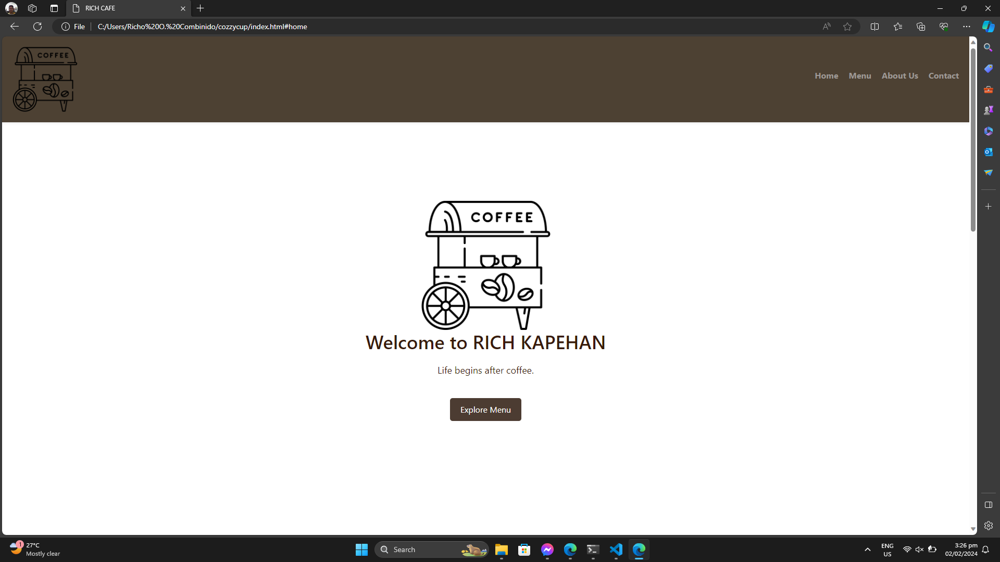
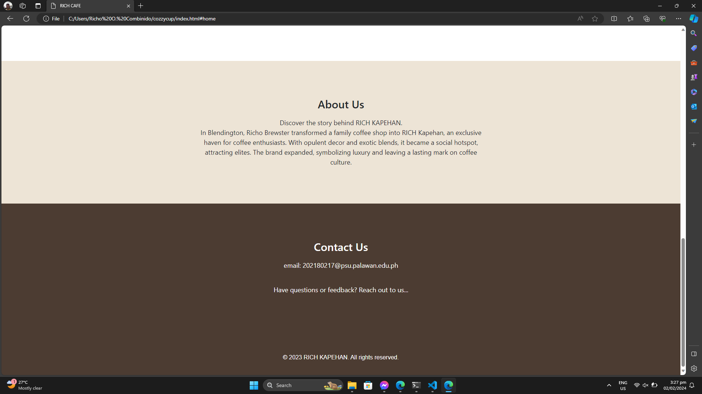

# Project Description

Welcome to Rich Kapehan, where every cup tells a story of indulgence and flavor. Nestled in the heart of Puerto Princesa City, Rich Kapehan is more than just a coffee shop—it's a sanctuary for coffee enthusiasts seeking a rich and aromatic experience.

Step into our warm and inviting space, adorned with rustic charm and a contemporary flair. The tantalizing aroma of freshly brewed coffee beans fills the air, creating an atmosphere that invites you to unwind, connect, and savor the moment.

At Rich Kapehan, we take pride in curating a diverse selection of premium coffee beans sourced from the finest coffee-growing regions around the world. Our skilled baristas, passionate about their craft, artfully craft each cup to perfection, ensuring that every sip is a journey of indulgence.

Whether you're a seasoned coffee connoisseur or a casual drinker, our menu caters to all tastes and preferences. From velvety espressos to creamy lattes, and from bold pour-overs to decadent flavored options, Rich Kapehan promises a delightful array of choices to suit every palate.

Our commitment to quality extends beyond the coffee beans. Indulge in our delectable pastries and treats, expertly paired to complement the nuanced flavors of our coffee offerings. The cozy ambiance and friendly staff make Rich Kapehan the perfect spot to catch up with friends, work remotely, or simply enjoy a quiet moment of solitude with your favorite brew.

Embrace the richness of life at Rich Kapehan, where every cup is a celebration of flavor, community, and the joy found in the simple pleasures of a well-brewed coffee.

 ## Features
* Menu
* Home
* About
* Contact

## Screen Captures

Welcome to Rich "Kapehan", a haven where every cup is brewed with warmth and served with genuine smiles. As you step through our doors, the inviting aroma of freshly ground coffee beans wraps around you, inviting you to immerse yourself in a world of rich flavors and delightful moments. Our coffee shop is more than just a space; it's a community where friends meet, and connections are forged over velvety espressos, creamy lattes, and an array of meticulously crafted brews. Take a seat, unwind, and indulge in the artistry of our skilled baristas as they transform each cup into a celebration of taste and quality. Here at Rich Kapehan, the welcome is as comforting as our coffee, and every visit promises a journey into the heart of warmth, conversation, and the joy found in the simple pleasures of life. Cheers to making lasting memories and savoring the richness of each moment at Rich Kapehan.

## About the Authors

Remark Timonez -Founder and Culinary Curator of Rich Kapehan:
Olivia, a visionary in the realm of culinary arts, channels her profound passion for flavors and aesthetics into the heart of Rich Kapehan. With a robust background in culinary design, she takes the helm in curating the café's delightful menu, meticulously ensuring that each dish narrates a tale of unparalleled quality and creative finesse. Olivia's unwavering commitment to creating a sensory journey is palpable in every bite, making Rich Kapehan not just a coffee shop but a sanctuary for gastronomic bliss. The fusion of her culinary expertise and dedication transforms each visit into a harmonious experience, inviting patrons to savor the richness of flavors and the artistry infused into every dish at Rich Kapehan.

Richo- Co-founder and Design Maestro at Rich Kapehan:
The creative spirit shaping the ambiance of Rich Kapehan, I, Richo Combinido, infuse our space with warmth and distinctive character. With a passion for design, my keen eye transforms the coffee shop into a haven of tranquility, inviting patrons to linger, connect, and truly savor each moment. My commitment to aesthetic precision ensures that every visit to Rich Kapehan is not just a coffee experience but a visual and tactile delight. From the carefully chosen decor to the layout that fosters a sense of community, my dedication to creating a welcoming and visually pleasing environment enhances the overall richness of your coffee journey at Rich Kapehan.

## Contact Us

Feel free to contact us for deliveries and reservation. You are always welcome to Rich Kapehan.

 **Name:** Richo O. Combinido

 **Email:** 202180217@psu.palawan.edu.ph

 **Name:** Remark Timones

 **Email:** 202180037@psu.palawan.edu.ph

For more details, visit the [Contact Section](#contact-us)

--- 

***&copy; 2023 Rich Kapehan. All Rights Reserved.**

Connect with us on our social media:

**Remark Timones**

**Richo Combinido**

